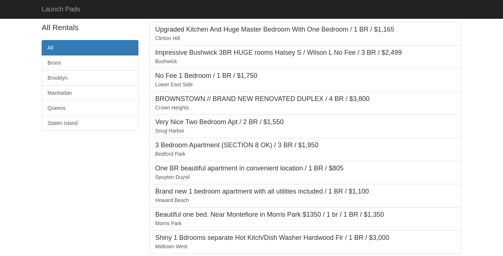

# Project 4: Launch Pads

Apartment marketplace app with city filtering, and rendering JSON data using AJAX.

## Links

jQuery: http://jquery.com/

Bootstrap: http://getbootstrap.com/

Arrays: http://www.w3schools.com/js/js_arrays.asp

Objects: http://www.w3schools.com/js/js_objects.asp

## Challenge
* Add [Bootstrap JS](https://maxcdn.bootstrapcdn.com/bootstrap/3.3.5/js/bootstrap.min.js) to your application
* Following the Bootstrap documentation, use a Bootstrap modal or alert to notify the user when a listing has been clicked that a new tab has been opened in Google Maps

